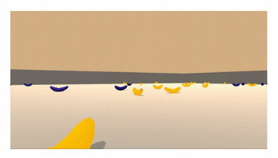

# RL Banana Collector

## Project Details
We present multiple Deep Reinforcement solutions to the Banana Collection environment from 
the **Unity Machine Learning Agents**. 
A range of possible implementations are available with some of those being able to solve
the task faster than others. This includes
* Basic DQN implementation
* Fixed Target DQN
* Double Q Learning
* Dueling DQN

and combinations of the above. The task at hand is to navigate an environment by choosing
an action out of four choices (forward, back, left, right) in reaction to the game state
which consists of 37 dimensions that include the agent's velocity along 
with ray-based perception of objects around the agent's forward direction. 
Collection of a yellow banana gives a reward of +1, collection of a blue banana
a penalty of -1.


## Getting Started
The following section is taken from the Deep Reinforcement Udacity class

### Step 1: Clone the DRLND Repository

Please follow the instructions in the 
[DRLND GitHub repository](https://github.com/udacity/deep-reinforcement-learning#dependencies) 
to set up your Python environment. 
These instructions can be found in README.md at the root of the repository. 
By following these instructions, you will install PyTorch, the ML-Agents toolkit, 
and a few more Python packages required to complete the project.

(*For Windows users*) The ML-Agents toolkit supports Windows 10. 
While it might be possible to run the ML-Agents toolkit using other versions of Windows, 
it has not been tested on other versions. 
Furthermore, the ML-Agents toolkit has not been tested on a Windows VM 
such as Bootcamp or Parallels. 

### Step 2: Download the Unity Environment

For this project, you will not need to install Unity - this is because we have already built the environment for you, and you can download it from one of the links below. You need only select the environment that matches your operating system:

* Linux: [click here](https://s3-us-west-1.amazonaws.com/udacity-drlnd/P1/Banana/Banana_Linux.zip)
* Mac OSX: [click here](https://s3-us-west-1.amazonaws.com/udacity-drlnd/P1/Banana/Banana.app.zip)
* Windows (32-bit): [click here](https://s3-us-west-1.amazonaws.com/udacity-drlnd/P1/Banana/Banana_Windows_x86.zip)
* Windows (64-bit): [click here](https://s3-us-west-1.amazonaws.com/udacity-drlnd/P1/Banana/Banana_Windows_x86_64.zip)

Then, place the file in the p1_navigation/ folder in the DRLND GitHub repository, and unzip (or decompress) the file.

(For Windows users) Check out 
[this link](https://support.microsoft.com/en-us/help/827218/how-to-determine-whether-a-computer-is-running-a-32-bit-version-or-64) 
if you need help with determining if your computer is running a 32-bit version or 64-bit version of the Windows operating system.

(For AWS) If you'd like to train the agent on AWS (and have not 
[enabled a virtual screen](https://github.com/Unity-Technologies/ml-agents/blob/master/docs/Training-on-Amazon-Web-Service.md)
), then please use 
[this link](https://s3-us-west-1.amazonaws.com/udacity-drlnd/P1/Banana/Banana_Linux_NoVis.zip) 
to obtain the "headless" version of the environment. 
You will not be able to watch the agent without enabling a virtual screen, 
but you will be able to train the agent. 
(*To watch the agent, you should follow the instructions to 
[enable a virtual screen](https://github.com/Unity-Technologies/ml-agents/blob/master/docs/Training-on-Amazon-Web-Service.md)
, and then download the environment for the Linux operating system above.*)

## Instructions
To run the training algorithm simply run 
```
python main.py
```
The same file can be modified to change hyper-parameter or models. 
