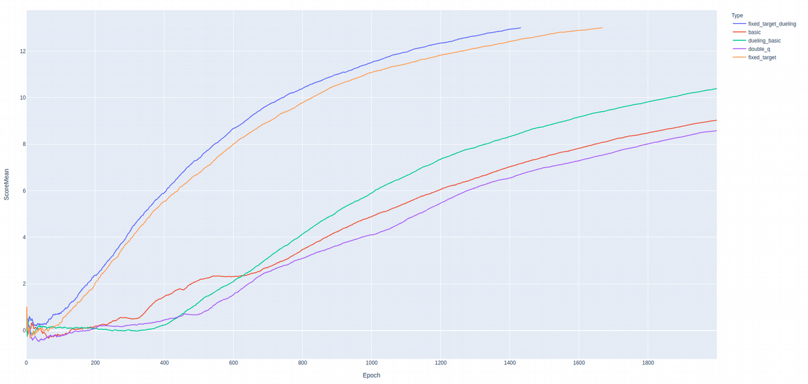

# Report
## Learning Algorithm
	
The underlying Deep-Q Network consists of two hidden layers of size 64 with ReLU activation.
Input and output size are defined by the environment as 37 and 4, respectively.
As an alternative a Dueling Deep-Q Network was tested where the outputs of the second hidden
layer are routed through a value- and an advantage-layer before being aggregated again. 

For the training algorithm a variety of approaches were tested:
* Basic DQN learning: the same Q network is used to determine the targets and expected values 
    and immediately updated 
* fixed target DQN: we use two different Q networks, one determines the targets and a different 
    one that is kept fixed determines the expected values. 
* Double DQN: two independent networks are used. Here the targets are calculated for both, 
    the minimum of the two is actually chosen. Then both networks calculate the expected
    values and back-propagation

## Plot of Rewards
	

The above plot shows the mean score over 100 episodes. The best-performing variations were the 
two fixed-target implementations with an advantage for the dueling networks. Both solved the 
problem in well below 2000 episodes, the dueling DQN implementation with fixed target in 1475 episodes.
The other three implementations performed rather similar with
a slight advantage for the basic implementation with a dueling DQN. Notice that while they did
not solve the problem sufficiently fast, all of them were clearly learning. 

Judging from the results here the Double-Q implementation definitely needs an overhaul. 
Since it does not even out-perform the basic implementation there needs to be something wrong. 

## Ideas for Future Work
The following tasks are partially or fully open:
* Fix the Double-Q implementation: the current one does not seem to learn fast enough;
  either the implementation is wrong, or it needs improvement
* Include prioritized experience replay
* Use (probably two) convolution layers to learn from the graphics output rather than the 
    environment state
* Proper hyper-parameter training: since even the most basic DQN implementation comes close 
    to solving this problem a hyper-parameter tuning was skipped all-together in favor 
    of an exploration of the different DQN variations. This would include exploring different
  layer sizes, learning rates, discount factors and others